2018-11-27 Baltimore Bridges 2018-12-06
================
zpb
December 6, 2018

clean data & load up some packages
==================================

``` r
set.seed(6942069)
library(tidyverse)
```

    ## -- Attaching packages ------------------------------------------------------------------------------ tidyverse 1.2.1 --

    ## v ggplot2 3.1.0     v purrr   0.2.5
    ## v tibble  1.4.2     v dplyr   0.7.8
    ## v tidyr   0.8.2     v stringr 1.3.1
    ## v readr   1.2.1     v forcats 0.3.0

    ## -- Conflicts --------------------------------------------------------------------------------- tidyverse_conflicts() --
    ## x dplyr::filter() masks stats::filter()
    ## x dplyr::lag()    masks stats::lag()

``` r
library(scales)
```

    ## 
    ## Attaching package: 'scales'

    ## The following object is masked from 'package:purrr':
    ## 
    ##     discard

    ## The following object is masked from 'package:readr':
    ## 
    ##     col_factor

``` r
library(forcats)
library(splines)
library(broom)
theme_set(theme_light())

maryland_bridges <- read_csv("https://raw.githubusercontent.com/zpbillman/Tidy_Tuesday/master/Tidy%20Tuesday%20Archives/2018-12-06%20Baltimore%20Bridges/baltimore_bridges%5B1%5D.csv") %>%
  select(-vehicles) %>%
  filter(yr_built >= 1900) %>%
  replace_na(list(responsibility = "Replaced by tidyr")) %>%
  mutate(
    county = replace(county, county == "Baltimore city", "Baltimore City"),
    inspection_yr = inspection_yr + 2000,
    decade = 10 * (yr_built %/% 10),
    responsibility = fct_lump(responsibility, 4)
    )
```

    ## Parsed with column specification:
    ## cols(
    ##   lat = col_double(),
    ##   long = col_double(),
    ##   county = col_character(),
    ##   carries = col_character(),
    ##   yr_built = col_double(),
    ##   bridge_condition = col_character(),
    ##   avg_daily_traffic = col_double(),
    ##   total_improve_cost_thousands = col_double(),
    ##   inspection_mo = col_character(),
    ##   inspection_yr = col_double(),
    ##   owner = col_character(),
    ##   responsibility = col_character(),
    ##   vehicles = col_character()
    ## )

histogram of bridges built after 1880
=====================================

``` r
maryland_bridges %>%
  count(semidecade = 5 * (yr_built %/% 5)) %>%
  ggplot(aes(x = semidecade, y = n)) +
  geom_histogram(stat = "identity") +
  expand_limits(y = 0) +
  labs(
    y = "Number of Bridges built in Maryland per 5 years",
    x = ""
    )
```

    ## Warning: Ignoring unknown parameters: binwidth, bins, pad

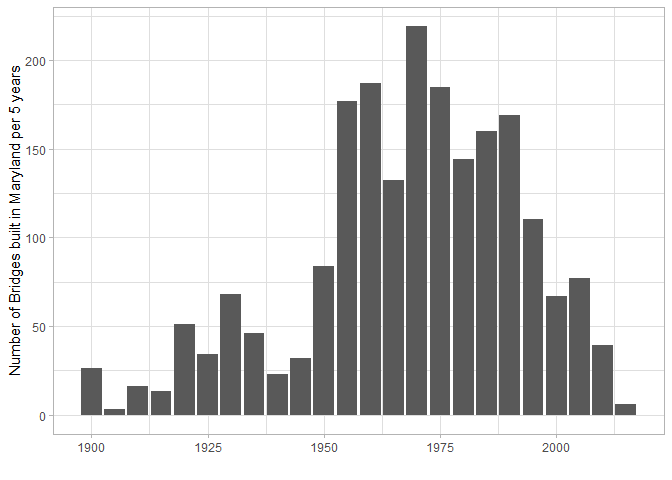

count by decade
===============

%/% is integer division which just divides by the number after the operator and leaves no remainder e.g. 22 %/% 10 = 2 & 132 %/% 10 = 13

``` r
maryland_bridges %>%
  count(decadeBuilt = 10 * (yr_built %/% 10))
```

    ## # A tibble: 12 x 2
    ##    decadeBuilt     n
    ##          <dbl> <int>
    ##  1        1900    29
    ##  2        1910    29
    ##  3        1920    85
    ##  4        1930   114
    ##  5        1940    55
    ##  6        1950   261
    ##  7        1960   319
    ##  8        1970   404
    ##  9        1980   304
    ## 10        1990   279
    ## 11        2000   144
    ## 12        2010    45

Age of bridge relationship with condition
=========================================

``` r
maryland_bridges %>%
  group_by(decade) %>%
  summarize(
    pct_good = mean(bridge_condition == "Good"),
    total = n()
    ) %>%
  ggplot(aes(x = decade, y = pct_good)) +
  geom_bar(stat = "identity") +
  scale_y_continuous(labels = percent_format()) +
  expand_limits(y = 0) +
  labs(
    y = "Percent bridges in Maryland that are rated 'Good'",
    x = ""
    )
```

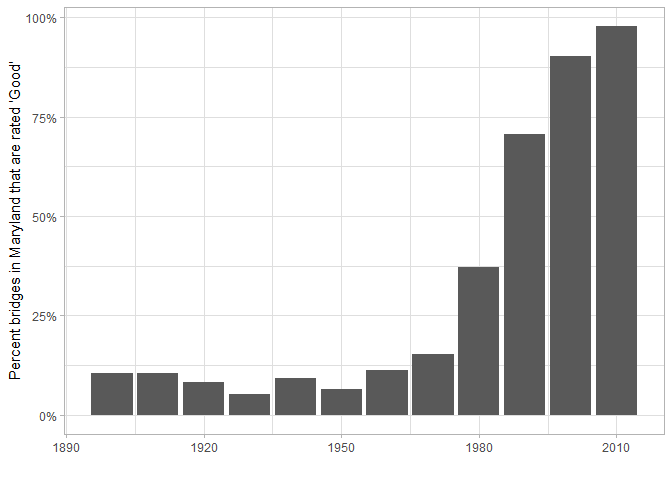

Most bridges built before 1970 aren't great. The vast majority of bridges after 2000 are Good.

``` r
maryland_bridges %>%
  group_by(decade) %>%
  summarize(
    pct_good = mean(bridge_condition == "Good"),
    total = n()
    ) %>%
  ggplot(aes(x = decade, y = pct_good)) +
  geom_line() +
  #geom_smooth(method = "lm") +
  scale_y_continuous(labels = percent_format()) +
  expand_limits(y = 0) +
  labs(
    y = "Percent bridges in Maryland that are rated 'Good'",
    x = ""
    )
```

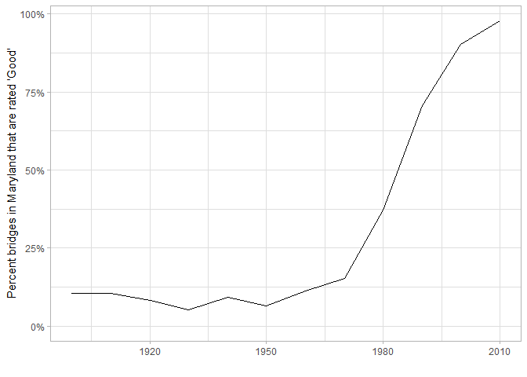

Responsibility of roads
=======================

Notice to change the NAs to something else we needed to do a list. I don't know why :|

``` r
maryland_bridges %>%
  replace_na(list(responsibility = "Other")) %>%
  count(responsibility = fct_lump(responsibility, 4), sort = TRUE) %>%
  mutate(responsibility = reorder(responsibility, n)) %>%
  ggplot(aes(x = responsibility, y = n)) +
  geom_col() +
  coord_flip()
```

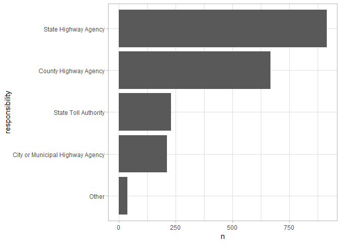

Rating by responsibility
========================

``` r
maryland_bridges %>%
  replace_na(list(responsibility = "Other")) %>%
  group_by(
    responsibility = fct_lump(responsibility, 4),
    decade
    ) %>%
  summarize(
    pct_good = mean(bridge_condition == "Good"),
    total = n()
    ) %>%
  filter(responsibility != "Other") %>%
  ggplot(aes(x = decade, y = pct_good, color = responsibility)) +
  geom_line() + 
  scale_y_continuous(labels = percent_format()) +
  expand_limits(y = 0) +
  labs(
    y = "Precentage of bridges in Maryland rated 'Good' by responsibility",
    x = "")
```

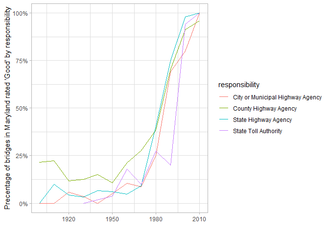

Traffic
=======

To get a nice looking 10^.x scales there is a link in R&gt;General&gt;How to use exponents...

``` r
maryland_bridges %>%
  ggplot(aes(avg_daily_traffic)) +
  geom_histogram() +
  scale_x_log10(labels = comma)
```

    ## `stat_bin()` using `bins = 30`. Pick better value with `binwidth`.

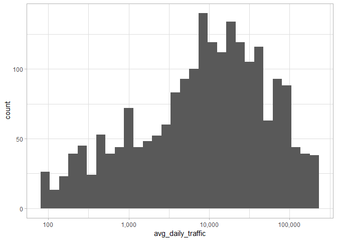

Summary of quintiles
====================

quintiles determined by quantile(avg\_daily\_traffic, c(0, .2, .4, .6, .8, 1))

``` r
maryland_bridges %>%
  filter(yr_built >= 1990) %>%
  group_by(traffic_category = cut(avg_daily_traffic, c(0, 1400, 6821, 16752, 42559, Inf))) %>%
  summarize(
    pct_good = mean(bridge_condition == "Good"),
    total = n()
    )
```

    ## # A tibble: 5 x 3
    ##   traffic_category    pct_good total
    ##   <fct>                  <dbl> <int>
    ## 1 (0,1.4e+03]            0.777   112
    ## 2 (1.4e+03,6.82e+03]     0.791    91
    ## 3 (6.82e+03,1.68e+04]    0.765   102
    ## 4 (1.68e+04,4.26e+04]    0.831    77
    ## 5 (4.26e+04,Inf]         0.814    86

How does traffic affect how well maintained a brdige is?
========================================================

using ntile(value, n) breaks a set of data into its n tiles. Here I use 5 for quintiles Required to set quintile as a character to get ggplot to read them as descrete

``` r
maryland_bridges %>%
  mutate(traffic_quintile = as.character(ntile(avg_daily_traffic, 5))) %>%
  group_by(
    traffic_quintile,
    decade
    ) %>%
  summarize(
    pct_good = mean(bridge_condition == "Good"),
    total = n()
    ) %>%
  ggplot(aes(x = decade, y = pct_good, color = traffic_quintile)) +
  geom_line()
```

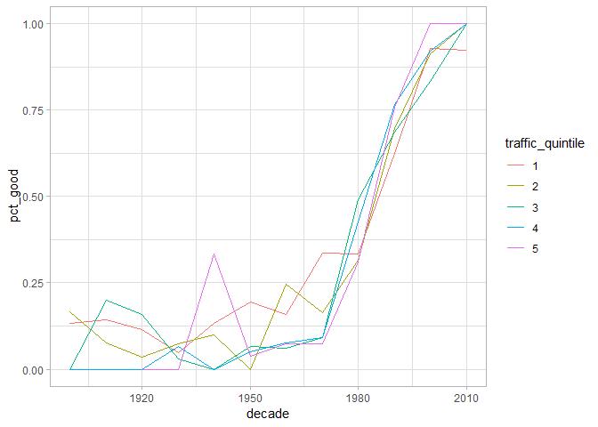

making a map for the first time ever!
=====================================

The call to arrange() puts the high values later

``` r
maryland_bridges %>%
  arrange(avg_daily_traffic) %>%
  ggplot(aes(x = long, y = lat, color = avg_daily_traffic)) +
  borders("state", regions = "Maryland") +
  geom_point() +
  scale_color_viridis_c(direction = -1,
                        labels = comma_format()) +
  coord_map() +
  theme_void()
```

    ## 
    ## Attaching package: 'maps'

    ## The following object is masked from 'package:purrr':
    ## 
    ##     map

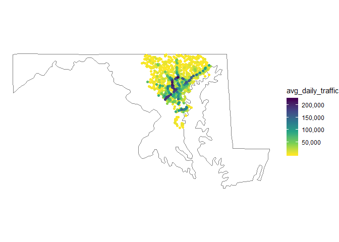

Practice with log10 transformation of gradient
==============================================

``` r
maryland_bridges %>%
  arrange(avg_daily_traffic) %>%
  ggplot(aes(x = long, y = lat, color = avg_daily_traffic)) +
  borders("state", regions = "Maryland") +
  geom_point() +
  scale_color_gradient2(low = "blue", 
                        high = "red",
                        midpoint = log10(median(maryland_bridges$avg_daily_traffic)),
                        trans = "log10",
                        labels = comma_format()) +
  coord_map() +
  theme_void()
```

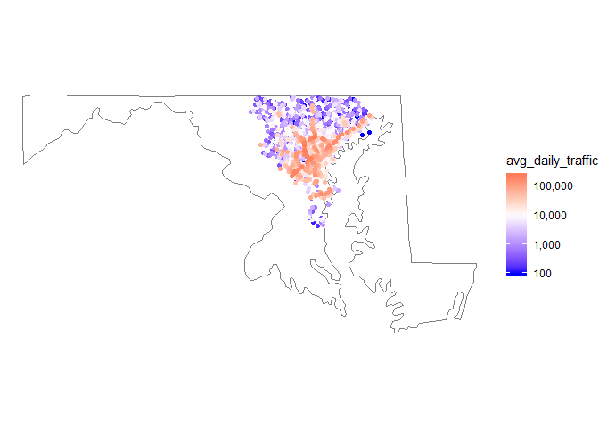

Bridges on map colored by county
================================

``` r
maryland_bridges %>%
  ggplot(aes(x = long, y = lat, color = county)) +
  borders("state", regions = "Maryland") +
  geom_point() +
  scale_color_brewer(palette = "Dark2") +
  coord_map() +
  theme_void()
```

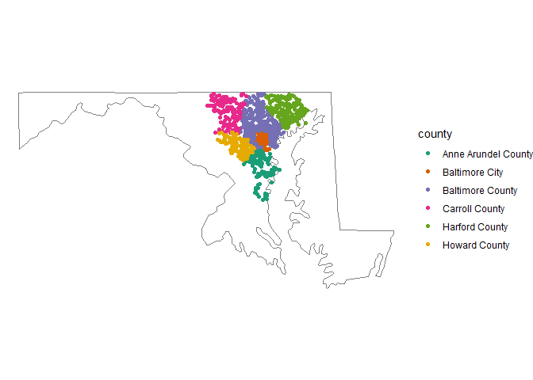

County responsibility on precentage of bridges rated 'Good' by year
===================================================================

``` r
maryland_bridges %>%
  group_by(
    county,
    decade
    ) %>%
  summarize(
    pct_good = mean(bridge_condition == "Good"),
    total = n()
    ) %>%
  ggplot(aes(x = decade, y = pct_good, color = county)) +
  geom_line() + 
  scale_y_continuous(labels = percent_format()) +
  expand_limits(y = 0) +
  labs(
    y = "Precentage of bridges in Maryland rated 'Good' by county",
    x = "")
```

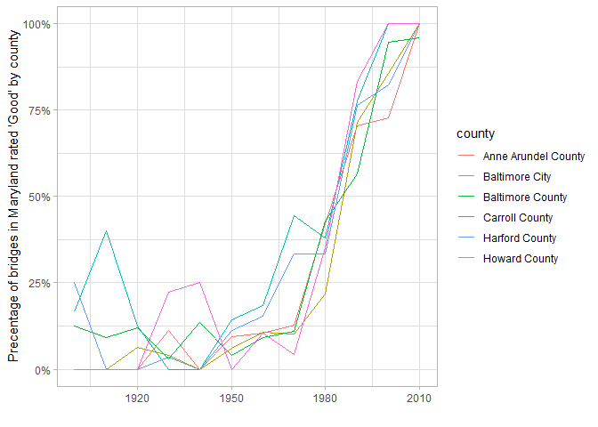

Effect of county responsibilty and time on bridge condition
===========================================================

Need to put data = ., otherwise it would pipe this dataframe right into the start

``` r
maryland_bridges %>%
  mutate(good = bridge_condition == "Good") %>%
  glm(good ~ yr_built, data = .) %>%
  summary()
```

    ## 
    ## Call:
    ## glm(formula = good ~ yr_built, data = .)
    ## 
    ## Deviance Residuals: 
    ##     Min       1Q   Median       3Q      Max  
    ## -0.6985  -0.3181  -0.1719   0.3795   1.3841  
    ## 
    ## Coefficients:
    ##               Estimate Std. Error t value Pr(>|t|)    
    ## (Intercept) -1.891e+01  7.233e-01  -26.15   <2e-16 ***
    ## yr_built     9.753e-03  3.671e-04   26.57   <2e-16 ***
    ## ---
    ## Signif. codes:  0 '***' 0.001 '**' 0.01 '*' 0.05 '.' 0.1 ' ' 1
    ## 
    ## (Dispersion parameter for gaussian family taken to be 0.15705)
    ## 
    ##     Null deviance: 435.32  on 2067  degrees of freedom
    ## Residual deviance: 324.47  on 2066  degrees of freedom
    ## AIC: 2044.5
    ## 
    ## Number of Fisher Scoring iterations: 2

Now to model it
===============

augment takes the original data and models it with a new column called fitted A lot of the augment shit you need to tell it the type of prediction to make augment accepts a model object and adds that information to the original dataset

``` r
#fit a logistic model
simple_model <- maryland_bridges %>%
  mutate(good = bridge_condition == "Good") %>% #adds column that shows status of Good as True or False
  glm(good ~ yr_built, data = ., family = "binomial")

augment(simple_model, maryland_bridges, type.predict = "response") %>%
  ggplot(aes(yr_built, .fitted)) +
  geom_line() +
  expand_limits(y = 1)
```

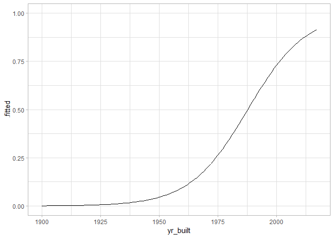

Same type of model, but now with more degrees of freedom Change the 2 to see different types of shapes and better understand DOF

``` r
dof_model <- maryland_bridges %>%
  mutate(good = bridge_condition == "Good") %>% #adds column that shows status of Good as True or False
  glm(good ~ ns(yr_built, 4), data = ., family = "binomial")

augment(dof_model, maryland_bridges, type.predict = "response") %>%
  ggplot(aes(yr_built, .fitted)) +
  geom_line() +
  expand_limits(y = 1)
```

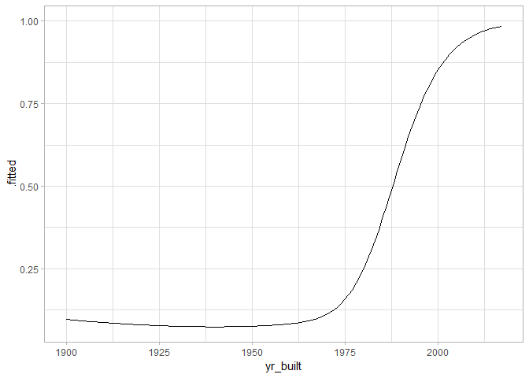

consider a spline fit for this same regression ns(yr\_built, 4) gives 4 degrees of freedom + responsibility allows responsibility to linearly affect it You can then use the color to pull them apart and see how that variable affects the model Year and responsibilty are not allowed to interact with each other in this model Goodness vs year, goodness vs responsibility, goodness vs county all put together

``` r
respYRcnty_model <- maryland_bridges %>%
  mutate(good = bridge_condition == "Good") %>%
  glm(good ~ ns(yr_built, 4) + responsibility + county, data = ., family = "binomial")

augment(respYRcnty_model, maryland_bridges, type.predict = "response") %>%
  ggplot(aes(yr_built, .fitted, color = responsibility)) +
  geom_line() +
  facet_wrap(~ county) +
  scale_y_continuous(labels = percent_format()) +
  labs(y = "Predicted probability a bridge built in a given decade will be rated 'Good'")
```

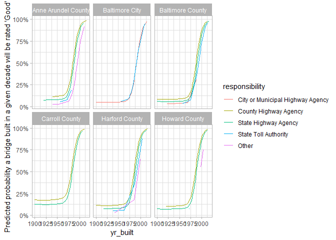

There are not significant differences between shit though LOL

Removed influence of county from above plot

``` r
respYR_model <- maryland_bridges %>%
  mutate(good = bridge_condition == "Good") %>%
  glm(good ~ ns(yr_built, 4) + responsibility, data = ., family = "binomial")

augment(respYR_model, maryland_bridges, type.predict = "response") %>%
  ggplot(aes(yr_built, .fitted, color = responsibility)) +
  geom_line() +
  scale_y_continuous(labels = percent_format()) +
  labs(y = "Predicted probability a bridge built in a given decade will be rated 'Good'")
```

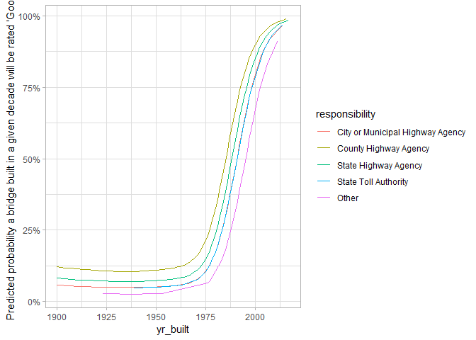

Above plot but with predictive estimates Notice mutate(reorder()) vs arrange(). Arrange controls dropping points on the paper, but not the order of factors

``` r
respYRcnty_model %>%
  tidy(conf.int = TRUE) %>%
  filter(str_detect(term,"responsibility|county")) %>%
  mutate(term = reorder(term, estimate)) %>%
  ggplot(aes(y = term, x = estimate)) +
  geom_point() +
  geom_errorbarh(aes(xmin = conf.low, xmax = conf.high))
```

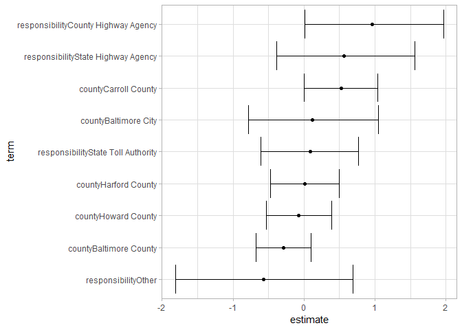

In a given year, the odds of a bridge having a rating of good because of who is responsible

``` r
respYR_model %>%
  tidy(conf.int = TRUE) %>%
  filter(str_detect(term,"responsibility")) %>%
  mutate(term = reorder(term, estimate)) %>%
  ggplot(aes(y = term, x = estimate)) +
  geom_point() +
  geom_errorbarh(aes(xmin = conf.low, xmax = conf.high))
```

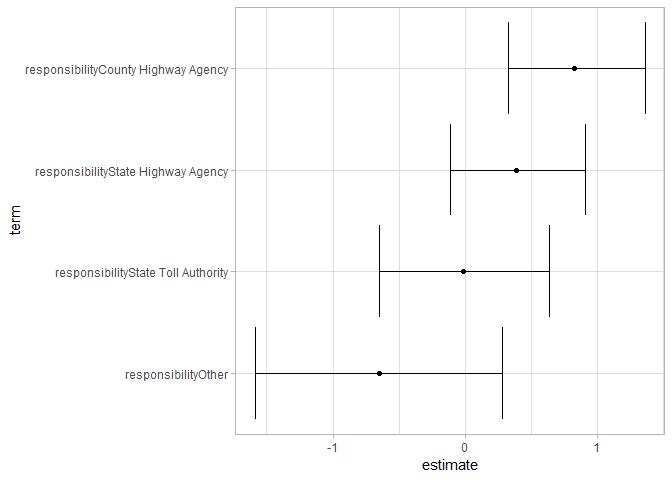
