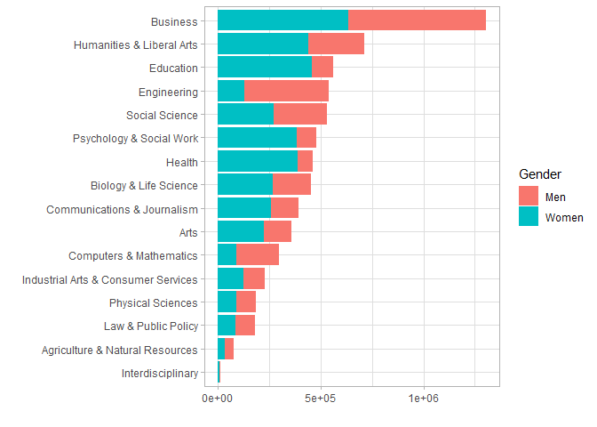
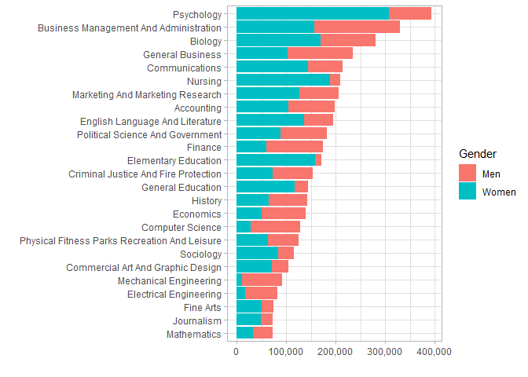
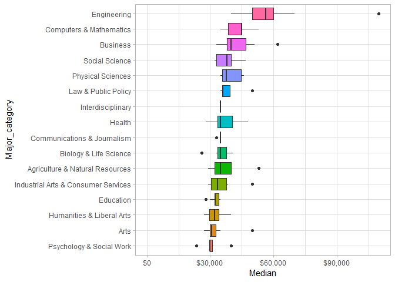
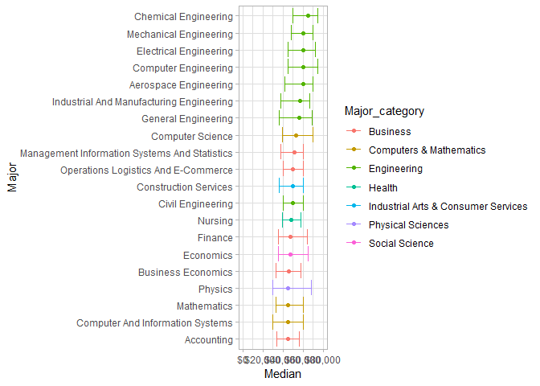
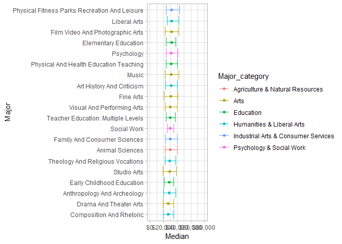
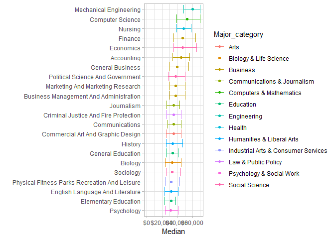
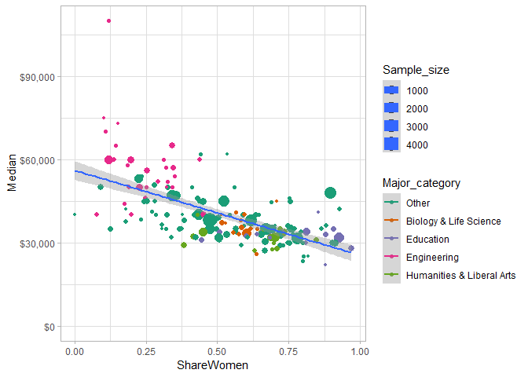
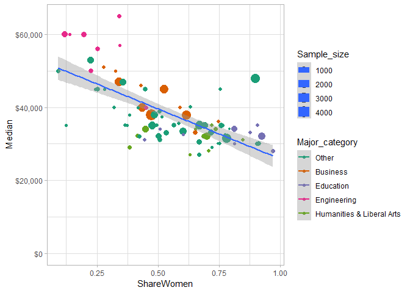
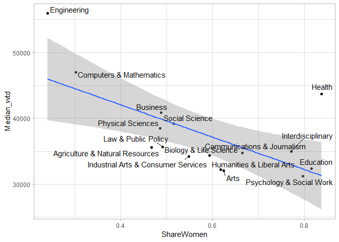

2018-12-08 College Major TT 2018-10-16
================
zpb
December 8, 2018

Loading Packages & Setting Themes
=================================

``` r
library(tidyverse)
```

    ## -- Attaching packages ------------------------------------------------------------------------------ tidyverse 1.2.1 --

    ## v ggplot2 3.1.0     v purrr   0.2.5
    ## v tibble  1.4.2     v dplyr   0.7.8
    ## v tidyr   0.8.2     v stringr 1.3.1
    ## v readr   1.3.0     v forcats 0.3.0

    ## -- Conflicts --------------------------------------------------------------------------------- tidyverse_conflicts() --
    ## x dplyr::filter() masks stats::filter()
    ## x dplyr::lag()    masks stats::lag()

``` r
library(scales)
```

    ## 
    ## Attaching package: 'scales'

    ## The following object is masked from 'package:purrr':
    ## 
    ##     discard

    ## The following object is masked from 'package:readr':
    ## 
    ##     col_factor

``` r
library(ggrepel)
library(broom)
library(plotly)
```

    ## 
    ## Attaching package: 'plotly'

    ## The following object is masked from 'package:ggplot2':
    ## 
    ##     last_plot

    ## The following object is masked from 'package:stats':
    ## 
    ##     filter

    ## The following object is masked from 'package:graphics':
    ## 
    ##     layout

``` r
theme_set(theme_light())
```

Grab dataset and clean it up
============================

``` r
recent_grads <- read_csv("https://raw.githubusercontent.com/rfordatascience/tidytuesday/master/data/2018-10-16/recent-grads.csv")
```

    ## Parsed with column specification:
    ## cols(
    ##   .default = col_double(),
    ##   Major = col_character(),
    ##   Major_category = col_character()
    ## )

    ## See spec(...) for full column specifications.

``` r
majors_processed <- recent_grads %>%
  arrange(desc(Median)) %>%
  mutate(Major = str_to_title(Major),
         Major = fct_reorder(Major, Median))

#consider using summarize_at(vars(Total, Men, Women), sum)
categories_processed <- majors_processed %>%
  filter(!is.na(Total)) %>% #Food science has an NA here!
  group_by(Major_category) %>%
  summarize(Total = sum(Total),
            Men = sum(Men),
            Women = sum(Women),
            ShareWomen = Women/Total,
            Samples = sum(Sample_size),
            Median_wtd = sum(Median * Sample_size) / sum(Sample_size),
            P25th_wtd = sum(P25th * Sample_size) / sum(Sample_size),
            P75th_wtd = sum(P75th * Sample_size) / sum(Sample_size))
```

Looking at sample size of dataset
=================================

Keep in mind the limitations of what we are looking at here

``` r
Hmisc::describe(majors_processed$Sample_size)
```

    ## majors_processed$Sample_size 
    ##        n  missing distinct     Info     Mean      Gmd      .05      .10 
    ##      173        0      147        1    356.1      491      7.0     14.4 
    ##      .25      .50      .75      .90      .95 
    ##     39.0    130.0    338.0   1028.0   1668.6 
    ## 
    ## lowest :    2    3    4    5    7, highest: 2394 2554 2584 2684 4212

Major category and gender
=========================

``` r
categories_processed %>%
  gather(Gender, Number, Men, Women) %>%
  mutate(Major_category = fct_reorder(Major_category, Total)) %>%
  ggplot(aes(Major_category, Number, fill = Gender)) +
  geom_col() +
  coord_flip() +
  labs(x = "", y = "")
```



25 most common majors and gender
================================

``` r
majors_processed %>%
  arrange(desc(Total)) %>%
  head(25) %>%
  gather(Gender, Number, Men, Women) %>%
  mutate(Major = fct_reorder(Major, Total)) %>%
  ggplot(aes(Major, Number, fill = Gender)) +
  geom_col() +
  scale_y_continuous(labels = comma_format()) +
  coord_flip() +
  labs(x = "", y = "")
```



Salary Grouped by Major Category
================================

Only taking majors over the 10th precentile of majors (15)

``` r
majors_processed %>%
  filter(Sample_size > 15) %>%
  mutate(Major_category = fct_reorder(Major_category, Median)) %>%
  ggplot(aes(Major_category, Median, fill = Major_category)) +
  geom_boxplot() +
  scale_y_continuous(labels = dollar_format()) +
  coord_flip() +
  expand_limits(y = 0) +
  theme(legend.position = "none")
```



What are the top earning majors
===============================

Plotting Top 20 Median Earners of those 50th precentile of sample size (130) Plot shows median (point) with interquartile range (25th - 75th quartiles)

``` r
majors_processed %>%
  filter(Sample_size >= 130) %>%
  head(20) %>%
  ggplot(aes(Major, Median, color = Major_category)) +
  geom_point() +
  geom_errorbar(aes(ymin = P25th, ymax = P75th)) +
  scale_y_continuous(labels = dollar_format()) +
  coord_flip() +
  expand_limits(y = 0:80000)
```



What are the lowest earning majors
==================================

Plotting Bottom 20 Median Earners of those 50th precentile of sample size (130) Plot shows median (point) with interquartile range (25th - 75th quartiles)

``` r
majors_processed %>%
  filter(Sample_size >= 130) %>%
  tail(20) %>%
  ggplot(aes(Major, Median, color = Major_category)) +
  geom_point() +
  geom_errorbar(aes(ymin = P25th, ymax = P75th)) +
  scale_y_continuous(labels = dollar_format()) +
  coord_flip() +
  expand_limits(y = 0:80000)
```



Look at earnings of the most common majors
==========================================

I took the 750 Sample\_size as my cutoff because the graph was pretty unreadbale unless I did that I chose this number because the majors after this point seemed more familiar Dot is median, and bars are 25th - 75th precentiles

``` r
majors_processed %>%
  filter(Sample_size >= 750) %>%
  ggplot(aes(Major, Median, color = Major_category)) +
  geom_point() +
  geom_errorbar(aes(ymin = P25th, ymax = P75th)) +
  scale_y_continuous(labels = dollar_format()) +
  coord_flip() +
  expand_limits(y = 0) +
  labs(x = "")
```



Job earnings based on share women in major
==========================================

Plot curve with a prediction line Also produce a summary to see if this is real or not

All majors
==========

``` r
g <- majors_processed %>%
  filter(!is.na(Total)) %>%
  mutate(Major_category = fct_lump(Major_category, 4),
         Major_category = fct_relevel(Major_category, "Other", after = 0)) %>%
  ggplot(aes(ShareWomen, Median, color = Major_category, size = Sample_size, label = Major)) +
  geom_point() +
  geom_smooth(aes(group = 1), method = lm) +
  scale_color_brewer(palette = "Dark2") +
  scale_y_continuous(labels = dollar_format()) +
  expand_limits(y = 0)

g
```



Only more common majors
=======================

50th precentile of sample size as cutoff (130+)

``` r
g <- majors_processed %>%
  filter(!is.na(Total) & Sample_size >= 130) %>%
  mutate(Major_category = fct_lump(Major_category, 4),
         Major_category = fct_relevel(Major_category, "Other", after = 0)) %>%
  ggplot(aes(ShareWomen, Median, color = Major_category, size = Sample_size, label = Major)) +
  geom_point() +
  geom_smooth(aes(group = 1), method = lm) +
  scale_color_brewer(palette = "Dark2") +
  scale_y_continuous(labels = dollar_format()) +
  expand_limits(y = 0)

g
```



Linear regression
=================

Weighted on sample size, so nothing filtered out on sample size Weighted linear regression expects MEANs not MEDIANs, so this is borked from the start

``` r
majors_processed %>%
  lm(Median ~ ShareWomen, data = ., weights = Sample_size) %>%
  summary()
```

    ## 
    ## Call:
    ## lm(formula = Median ~ ShareWomen, data = ., weights = Sample_size)
    ## 
    ## Weighted Residuals:
    ##     Min      1Q  Median      3Q     Max 
    ## -260500  -61042  -13899   33262  865081 
    ## 
    ## Coefficients:
    ##             Estimate Std. Error t value Pr(>|t|)    
    ## (Intercept)    52073       1436  36.255   <2e-16 ***
    ## ShareWomen    -23650       2403  -9.842   <2e-16 ***
    ## ---
    ## Signif. codes:  0 '***' 0.001 '**' 0.01 '*' 0.05 '.' 0.1 ' ' 1
    ## 
    ## Residual standard error: 123000 on 170 degrees of freedom
    ##   (1 observation deleted due to missingness)
    ## Multiple R-squared:  0.363,  Adjusted R-squared:  0.3592 
    ## F-statistic: 96.87 on 1 and 170 DF,  p-value: < 2.2e-16

``` r
majors_processed %>%
  filter(Sample_size >= 130 & !is.na(Total)) %>%
  lm(Median ~ ShareWomen, data = ., weights = Sample_size) %>%
  summary()
```

    ## 
    ## Call:
    ## lm(formula = Median ~ ShareWomen, data = ., weights = Sample_size)
    ## 
    ## Weighted Residuals:
    ##     Min      1Q  Median      3Q     Max 
    ## -260877  -88878  -27618   32049  863618 
    ## 
    ## Coefficients:
    ##             Estimate Std. Error t value Pr(>|t|)    
    ## (Intercept)    52063       1976  26.347  < 2e-16 ***
    ## ShareWomen    -23606       3299  -7.156 2.74e-10 ***
    ## ---
    ## Signif. codes:  0 '***' 0.001 '**' 0.01 '*' 0.05 '.' 0.1 ' ' 1
    ## 
    ## Residual standard error: 160900 on 85 degrees of freedom
    ## Multiple R-squared:  0.3759, Adjusted R-squared:  0.3686 
    ## F-statistic: 51.21 on 1 and 85 DF,  p-value: 2.739e-10

Seems like women tend to receive degrees in lower earning majors :thinking: Bottom line: If your major went from 100% men to 100% women, you could expect the median expected salary to go down by $23,650 In other words: Every precentage point of men in a major is ~$237 increase in median expected salary

Job earnings but for major categories
=====================================

Looking at the categories and share women Consider using logarithmic vs polynomial vs linear Rememeber that this median wage is WEIGHTED by the sample size Linear regression is then further weighted by sample size

``` r
categories_processed %>%
  ggplot(aes(ShareWomen, Median_wtd)) +
  geom_point() +
  geom_smooth(method = lm) +
  geom_text_repel(aes(label = Major_category), force = 8)
```



``` r
categories_processed %>%
  lm(Median_wtd ~ ShareWomen, data = ., weights = Samples) %>%
  summary()
```

    ## 
    ## Call:
    ## lm(formula = Median_wtd ~ ShareWomen, data = ., weights = Samples)
    ## 
    ## Weighted Residuals:
    ##     Min      1Q  Median      3Q     Max 
    ## -366854 -204031  -70545   27914  800848 
    ## 
    ## Coefficients:
    ##             Estimate Std. Error t value Pr(>|t|)    
    ## (Intercept)    55002       4453  12.352 6.45e-09 ***
    ## ShareWomen    -28804       7597  -3.791  0.00198 ** 
    ## ---
    ## Signif. codes:  0 '***' 0.001 '**' 0.01 '*' 0.05 '.' 0.1 ' ' 1
    ## 
    ## Residual standard error: 311600 on 14 degrees of freedom
    ## Multiple R-squared:  0.5066, Adjusted R-squared:  0.4714 
    ## F-statistic: 14.37 on 1 and 14 DF,  p-value: 0.001984

Share women within each category
================================

Within each Major\_category, what is the correlation between women and average salary

I need to sit down and explain the following lines nest(-Major\_category) %&gt;% mutate(model = map(data, ~ lm(Median ~ ShareWomen, data = ., weights = Sample\_size)), tidied = map(model, tidy))

First, nest() takes a dataframe and takes out one variable (in this case Major\_category) and then combines everything that is left into a dataframe called "data" and puts that into a single cell in a new tibble. See the print below. It's like split, except it takes out a variable and puts the remaining split dataframes into a list of tibbles next to it. Thank you Kanye, very cool!

Next, we add a column using mutate() that takes that new dataframe, and then just runs the regression we used before on it. Read the function as "For every data we want to apply the weighted linear model of Median explained by ShareWomen on these data, with these weights" map(data, map(data, ~ lm(Median ~ ShareWomen, blah blah blah blah))))

The KEY is that it is only running the linear regression WITHIN EACH MAJOR CATEGORY. This is going to be completely different than the previous modelling we've done because it uses this nesting trick to look at it one at a time.

The new column will be called model, and have all of the component of the output of the lm() function.

Then, we add another column, that runs the function broom::tidy() on each column model Read as, "A new column called `tidied` that, for each column model, runs tidy()"

tidy turns model into a 2 row tibble of coefficients

unnest(tidied) then takes the major\_category, slaps it onto the front of the rows of the 2 row tibble of coefficients and only returns all of the combinations of those 2 tables. It should only be 22 rows long now.

``` r
library(broom)

#To better understand what nest() does
majors_processed %>%
  select(Major, Major_category, Total, ShareWomen, Sample_size, Median) %>%
  add_count(Major_category) %>%
  filter(n >= 9) %>%
  nest(-Major_category)
```

    ## # A tibble: 11 x 2
    ##    Major_category                  data             
    ##    <chr>                           <list>           
    ##  1 Engineering                     <tibble [29 x 6]>
    ##  2 Business                        <tibble [13 x 6]>
    ##  3 Physical Sciences               <tibble [10 x 6]>
    ##  4 Computers & Mathematics         <tibble [11 x 6]>
    ##  5 Agriculture & Natural Resources <tibble [10 x 6]>
    ##  6 Health                          <tibble [12 x 6]>
    ##  7 Social Science                  <tibble [9 x 6]> 
    ##  8 Biology & Life Science          <tibble [14 x 6]>
    ##  9 Education                       <tibble [16 x 6]>
    ## 10 Humanities & Liberal Arts       <tibble [15 x 6]>
    ## 11 Psychology & Social Work        <tibble [9 x 6]>

``` r
#to show the output of the call to unnest()
majors_processed %>%
  select(Major, Major_category, Total, ShareWomen, Sample_size, Median) %>%
  add_count(Major_category) %>%
  filter(n >= 9) %>%
  nest(-Major_category) %>%
  mutate(model = map(data, ~ lm(Median ~ ShareWomen, data = ., weights = Sample_size)),
         tidied = map(model, tidy)) %>%
  unnest(tidied)
```

    ## # A tibble: 22 x 6
    ##    Major_category           term     estimate std.error statistic  p.value
    ##    <chr>                    <chr>       <dbl>     <dbl>     <dbl>    <dbl>
    ##  1 Engineering              (Interc~   63649.     3826.    16.6   1.02e-15
    ##  2 Engineering              ShareWo~  -33912.    15418.    -2.20  3.66e- 2
    ##  3 Business                 (Interc~   54603.     4875.    11.2   2.35e- 7
    ##  4 Business                 ShareWo~  -28171.     9810.    -2.87  1.52e- 2
    ##  5 Physical Sciences        (Interc~   44952.     6893.     6.52  1.84e- 4
    ##  6 Physical Sciences        ShareWo~  -12820.    13349.    -0.960 3.65e- 1
    ##  7 Computers & Mathematics  (Interc~   55334.     5669.     9.76  4.38e- 6
    ##  8 Computers & Mathematics  ShareWo~  -28694.    18552.    -1.55  1.56e- 1
    ##  9 Agriculture & Natural R~ (Interc~   42851.     2899.    14.8   1.55e- 6
    ## 10 Agriculture & Natural R~ ShareWo~  -16263.     5975.    -2.72  2.97e- 2
    ## # ... with 12 more rows

``` r
majors_processed %>%
  select(Major, Major_category, Total, ShareWomen, Sample_size, Median) %>%
  add_count(Major_category) %>%
  filter(n >= 9) %>%
  nest(-Major_category) %>%
  mutate(model = map(data, ~ lm(Median ~ ShareWomen, data = ., weights = Sample_size)),
         tidied = map(model, tidy)) %>%
  unnest(tidied) %>%
  filter(term == "ShareWomen") %>%
  arrange(estimate) %>%
  mutate(fdr = p.adjust(p.value, method = "fdr"))
```

    ## # A tibble: 11 x 7
    ##    Major_category       term   estimate std.error statistic p.value    fdr
    ##    <chr>                <chr>     <dbl>     <dbl>     <dbl>   <dbl>  <dbl>
    ##  1 Biology & Life Scie~ Share~  -43735.    20982.    -2.08  0.0592  0.108 
    ##  2 Engineering          Share~  -33912.    15418.    -2.20  0.0366  0.0916
    ##  3 Social Science       Share~  -33667.     7248.    -4.65  0.00236 0.0259
    ##  4 Computers & Mathema~ Share~  -28694.    18552.    -1.55  0.156   0.215 
    ##  5 Business             Share~  -28171.     9810.    -2.87  0.0152  0.0836
    ##  6 Psychology & Social~ Share~  -16425.     8312.    -1.98  0.0887  0.139 
    ##  7 Agriculture & Natur~ Share~  -16263.     5975.    -2.72  0.0297  0.0916
    ##  8 Physical Sciences    Share~  -12820.    13349.    -0.960 0.365   0.446 
    ##  9 Education            Share~   -1996.     3084.    -0.647 0.528   0.581 
    ## 10 Humanities & Libera~ Share~   -1814.     4128.    -0.439 0.668   0.668 
    ## 11 Health               Share~   54721.    23427.     2.34  0.0416  0.0916

Reading the output of the nest() & unnest() function Intercept estimate mostly gives you an idea of the earnings within a major\_category The ShareWomen estimate tells you, if you went from a 100% men major within a major\_category to a 100% women major within a category, you would expect a change of that much money in median wages

fdr is false discovery rate for mutiple testing. Consider this, when you do a big ole analysis that gives you a ton of p.values, even if you have p = 0.04, you have to consider that 1 in 25 of those values you find will not be real, but an artifact of what you are calling significant. The FDR tries to help determine the precent chance that a given value could be false

``` r
knitr::knit_exit()
```
